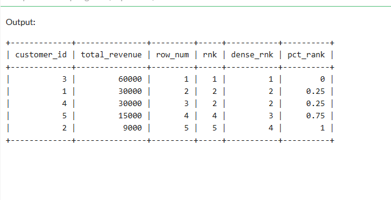
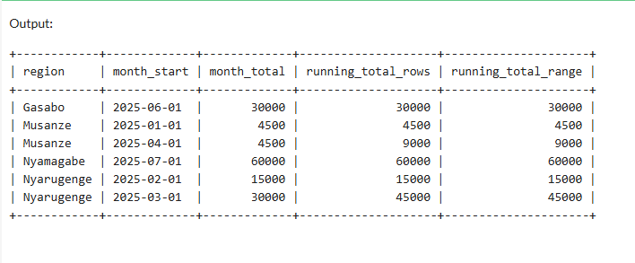
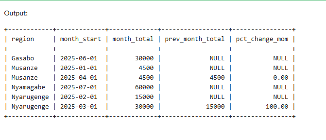
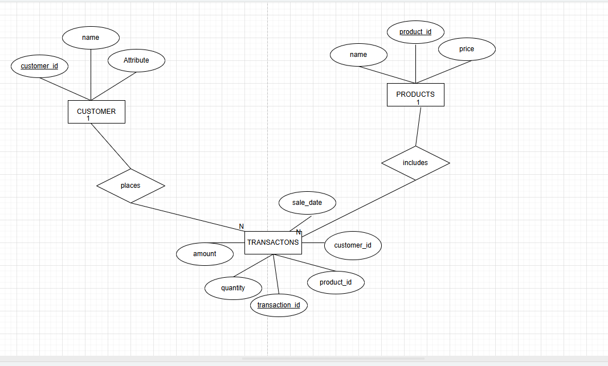

## STEP 1: PROBLEM DEFINITION 
Business context: Savory pastry shop with five branches across Rwanda serves red velvet, chocolate, cheesecake, and mousse pastries.

Data challenge: The management team wants to know the top-performing pastry type per branch, examine the sales trends, and customers' spending behavior to know the most preferred pastry in order to optimize the business's inventory and come up with appropriate marketing strategies.

Expected outcome: providing a clear report of the top-performing pastry and insights on the targeted customer's preference, which is meant to help the business in making strategic and informed decisions.

## STEP 2: SUCCESS CRITERIA
1. Identify the top 5 best selling pastries in each branch using ranking functions: RANK()
2. Cumulative monthly sales for each branch using windows function: SUM() OVER()
3. Compare one month's sales to the previous month's sales to determine the sales trend using: LAG() LEAD()
4. Segmenting customers into groups based on their total spendings using: NTILE()
5. compute the moving average of 3 month period to clearly see sales trends dynamics using: AVG() OVER()

## SCREENSHOT DESCRIPTION 

## STEP 6: RESULT ANALYSIS
1. DESCRIPTIVE
   The analysis has shown that Nyamagabe is the region which gave a high amount of revenue, with red velvet cake being the best performing pastry with 60000 rwf
2. DIAGNOSTIC
   Red velvet cakes high demand was likely due to the high number of youth in the area, which was boosted by the presence of many schools in the area making the product more    purchased than the rest
3.Prescriptive
  After looking at these results, I would recommend Savory pastry shop to increase the production of red velvet cakes and other similar products to attract more customers.    
## REFERENCES
YOUTUBE TUTORIAL SQL Window Functions | Clearly Explained | PARTITION BY, ORDER BY, ROW_NUMBER, RANK, DENSE_RANK: https://www.youtube.com/watch?v=rIcB4zMYMas
SQL Window Functions Explained (with examples): https://www.youtube.com/watch?v=xFeOVIIRyvQ
claude.ai
LECTURE NOTES

## INTEGRITY STATEMENT
All sources were properly cited. Implementations and analysis represent original work. No AI generated content was copied without attribution or adaptation.
